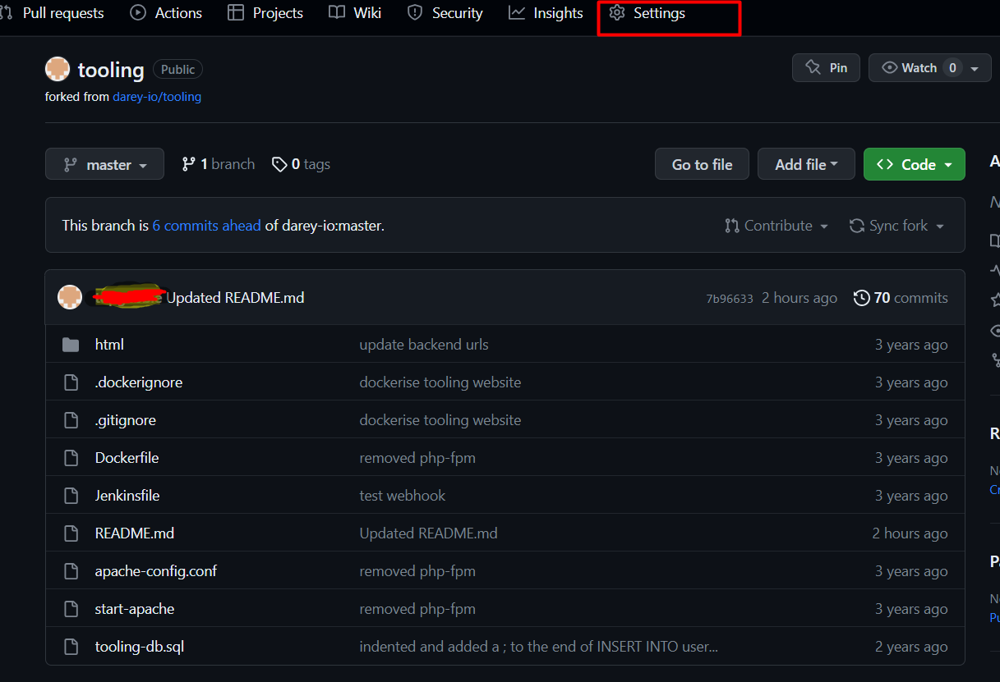
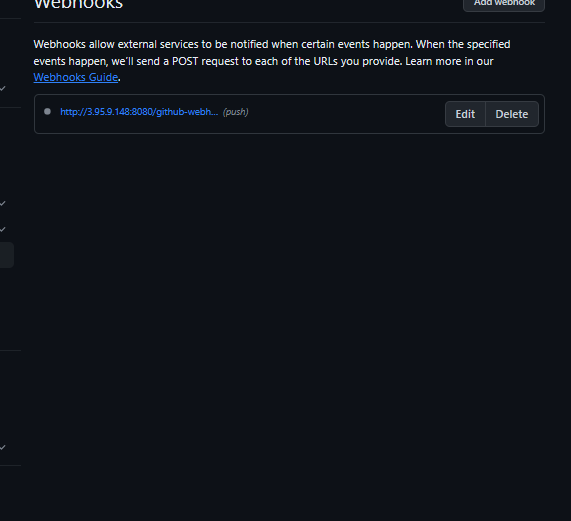
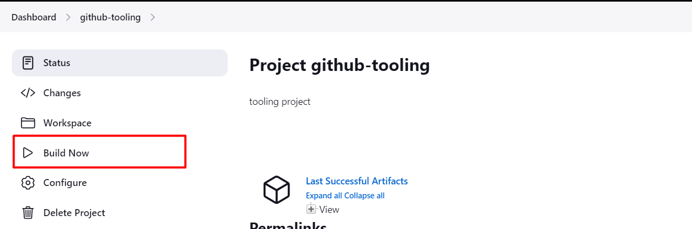
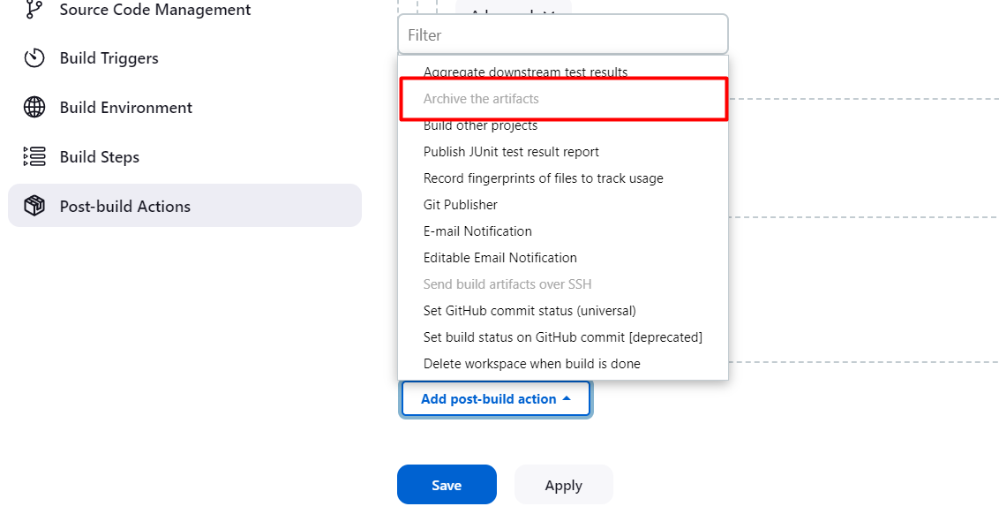
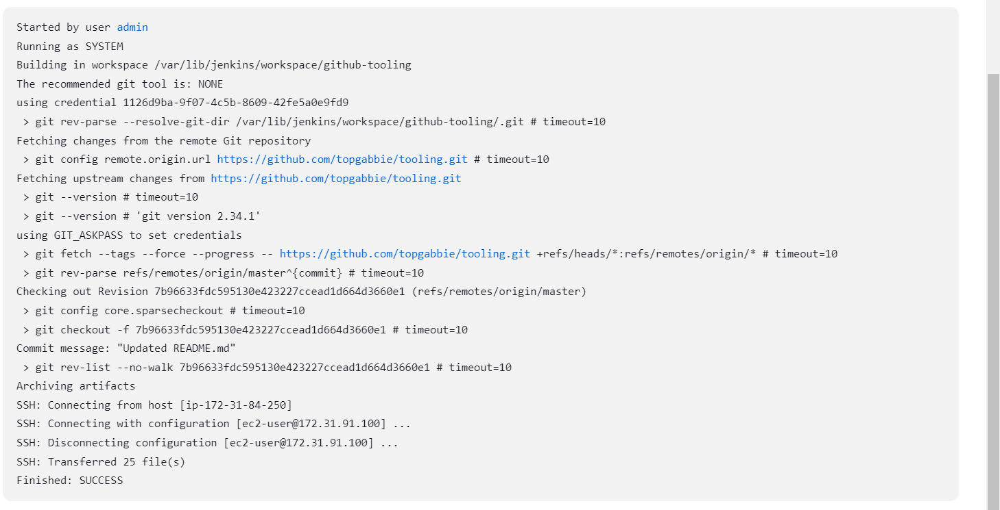

# TOOLING WEBSITE DEPLOYMENT AUTOMATION WITH CONTINUOUS INTEGRATION

## Objective

To configure a Jenkins server with will automatically deploy source code should there be any change in the code base and transfer the changes from our repo to NFS-server

## Step 1

### Configure and install Jenkins Server

1. Create an AWS EC2 server based on Ubuntu Server 20.04 LTS and name it “Jenkins”
2. Since Jenkins is a Java based Application, install JDK.

        sudo apt update
        sudo apt install default-jdk-headless
3. Install Jenkins with the commands below

        wget -q -O - https://pkg.Jenkins.io/debian-stable/Jenkins.io.key | sudo apt-key add -
        sudo sh -c 'echo deb https://pkg.Jenkins.io/debian-stable binary/ > \/etc/apt/sources.list.d/Jenkins.list'
        sudo apt update
        sudo apt-get install Jenkins
4. Confirm if Jenkins is up and running by running

        sudo systemctl status Jenkins

   
5. Create a new inbound rule for the Jenkins server. Jenkins server uses TCP port 8080
6. Now access the Jenkins from the browser with the server public IP and perform initial setup.

    
7. Retrieve the Jenkins password from the folder below

            sudo cat /var/lib/Jenkins/secrets/initialAdminPassword
8. Install the suggested plugins and create the admin user to complete the installation.

## Configure Jenkins to retrieve source codes from GitHub using WebHooks

We need to configure our GitHub so that changes on the GitHub repo will automatically trigger a build in our Jenkins server.

## Steps 2

1. Go to settings on the GitHub repo you wish to connect to the Jenkins server and select the WebHooks options

    
2. Click on add WebHook and input the code below

        http://<Jenkins-public-ip>:8080/github-webhook/    
    
3. Click on the new item option on the Jenkins webpage and create a freestyle project.
    
4. In the source code management section, paste the GitHub repo URL, provide the GitHub credentials and save
5. On the GitHub homepage, click on the the freestyle project and select**build now** option to manually trigger a build from our GitHub.
   
6. if build was successful, a build number ticked green will be generated below the console. You can also confirm the status of the build by inspecting the console output.
    

## Configure Auto Triggering of the Jenkins Server

From the configuration above, we need to manually select build now to build our codes.
we need to configure our project on Jenkins to automatically build whenever a change is committed on our GitHub repo linked to the Jenkins server.

1. On the Jenkins homepage, click on the job/project and select configure option.
2. Navigate to the built trigger option and check the GitHub hook trigger for GITSCM polling
    
3. Configure the Post build actions  to archive all the files – files resulted from a build are called “artifacts”.
    
4. Make a change on readme file in the GitHub repo and this should automatically trigger a build in our Jenkins server.
    .

## CONFIGURE JENKINS TO COPY FILES TO NFS SERVER VIA SSH

Now we have our artifacts saved locally on Jenkins server, the next step is to copy them to our NFS server to `/mnt/apps` directory.

## Steps 3.0

1. From the Jenkins webpage, install the **Publish over SSH** plugin
    
2. Configure the project to copy artifacts over SSH with the following steps

    - Select the system menu from the manage Jenkins option
    - Scroll to the publish over SSH option
    - Provide all the needed parameters which include:
       1. A private key (content of .Pem file that you use to connect to NFS server via SSH/Putty).
       2. Arbitrary name.
       3. Hostname – can be private IP address of your NFS server.
       4. Username – ec2-user (since NFS server is based on EC2 with RHEL 8)
       5. Remote directory – /mnt/apps since our Web Servers use it as a mounting point to retrieve files from the NFS server
    
    
3. Test the configuration and make sure the connection returns Success.
4. if you encounter an unstable error from Jenkins, change the permission of the /mnt/apps with the commands below

        sudo chmod 777 /mnt/apps
        sudo chown nobody:nobody /mnt/apps
        sudo chmod -R 777 /mnt
        sudo chown -R nobody:nobody /mnt
5. Add another Post build action to the Job as shown below:
    
6. Configure the Jenkins transfer to transfer all the artifacts to the NFS-server. This is achieved by using ** in the SSH source transfer set.
    
7. Save the configuration and make a change to the Readme file on our GitHub repo
    

## END
